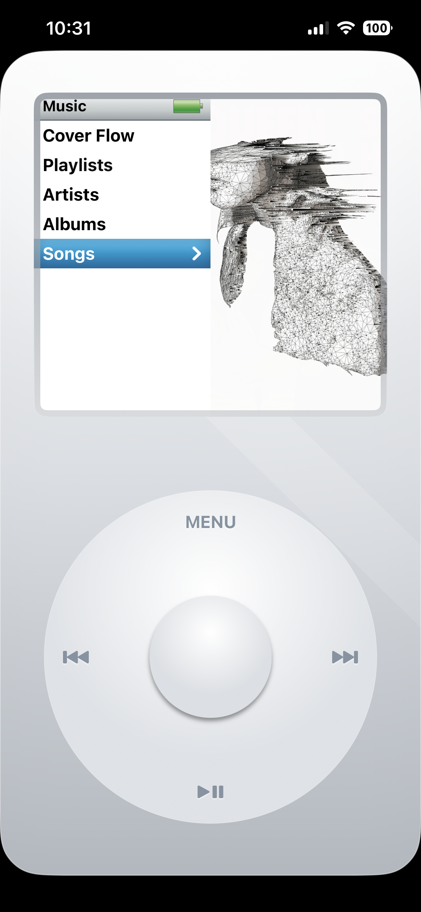
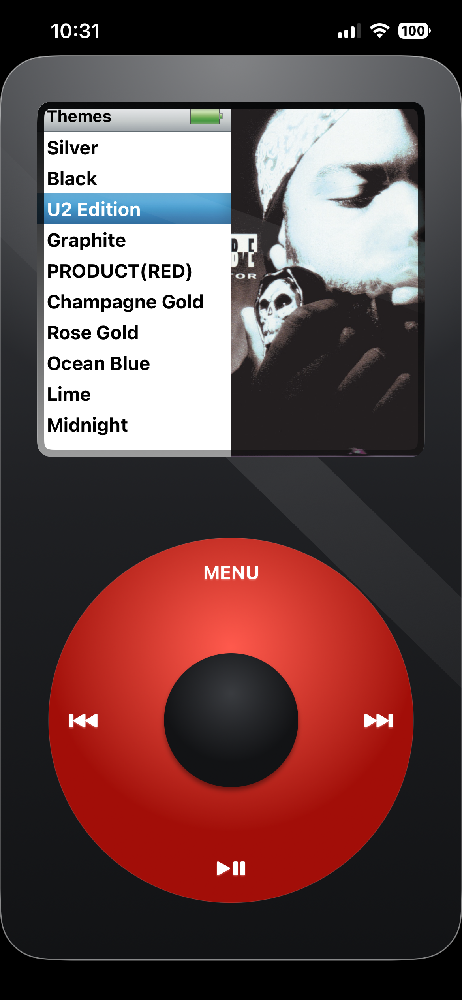
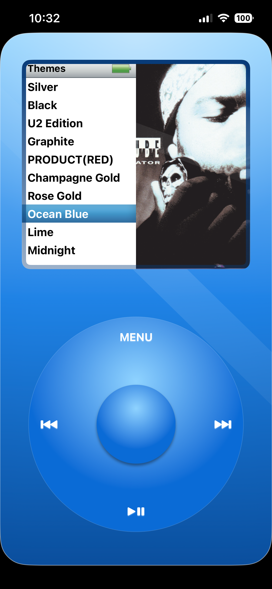
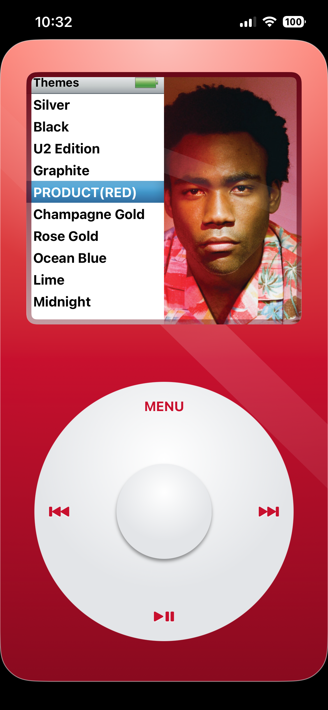

<div align="center">
  
# iPod Player

**Experience the nostalgia of the iPod — reimagined for today.**  
A love letter to the 2000s era of digital music, bringing the tactile joy of the Click Wheel and the magic of Cover Flow straight to your modern iOS device via SwiftUI and Apple Music.

</div>

<br>

<div align="center">
  
  
  
  
</div>

<hr>

<div align="center">
  
</div>

<br>

## About the Project

Remember when your entire music library fit in your pocket, and scrolling through it meant physically spinning a wheel until you felt the perfect *click*? 

**iPlayr** is a heavily modified, modernized tribute to the golden age of portable music players. It trades flat, sterile touch interfaces for procedural 3D elements, milled metal chassis effects, recessed LCD screens, and a meticulously rebuilt gesture system that genuinely feels like spinning a physical wheel. 

Built natively in **SwiftUI**, it harnesses the **Apple Music API** to seamlessly load your library, playlists, and albums.

<br>

## Features

* **The Return of Cover Flow:** Flip through your albums in glorious 3D space. Watch the reflections and album info dynamically update as you glide through your library.
* **Tactile Click Wheel:** A completely overhauled, zero-deadzone rotation gesture. Drag your thumb in a circle and feel satisfying, physics-based haptic *clicks* for every item you scroll past.
* **10 Procedural Themes:** The interface isn't just flat images. It renders real-time gradients, shadows, and bevels to simulate different anodized metals. Choose between iconic aesthetics like *Classic Silver, U2 Special Edition, Midnight, Slate, Product(RED)*, and more.
* **Full Apple Music Integration:** Direct access to your saved songs, artists, albums, and playlists. 
* **Authentic LCD Styling:** The screen features inner shadows and accurate dimensioning to simulate a physical glass display recessed beneath an aluminum faceplate.
* **Custom Sorting:** Sort your library how you want — whether by alphabetical order or "Date Added" — straight from the Settings menu.

<br>

## Prerequisites

Before running iPlayr, ensure you have:
- **Xcode 15** or later
- An **iOS 17+** device
- An active **Apple Music** subscription (required to load library data)

<br>

## Installation

1. **Clone the repository:**
   ```bash
   git clone https://github.com/keremersu35/iPodPlayer.git
   ```
2. **Open the project** in Xcode (`iPodPlayer.xcodeproj`).
3. **Build & Run** directly onto your connected iOS 17 device.
4. **Alternatively (Sideloading):** You can build the app into an `.ipa` file using the included `iPlayr/build-ipodplayer-ipa.sh` script, and then sideload the generated `.ipa` to your device using your preferred tool (e.g., SideStore, AltStore, Sideloadly).

*Note: The app relies on physical gestures and haptics, so it is highly recommended to run this on a real device rather than the iOS Simulator.*

<br>

## Acknowledgments & Credit

A heavily modified version of keremersu35/iPodPlayer project. The original repo has no license; published here with happy attribution :)

<br>

## Contribution & Support

We welcome contributions! To contribute:
1. Fork the repository
2. Create a new branch (`git checkout -b feature-branch-name`)
3. Commit your changes (`git commit -m "Add new feature"`)
4. Push to your branch (`git push origin feature-branch-name`)
5. Open a Pull Request

If you love the nostalgia trip, give the repo a star on GitHub! For any issues, feel free to open an issue or submit a PR.
